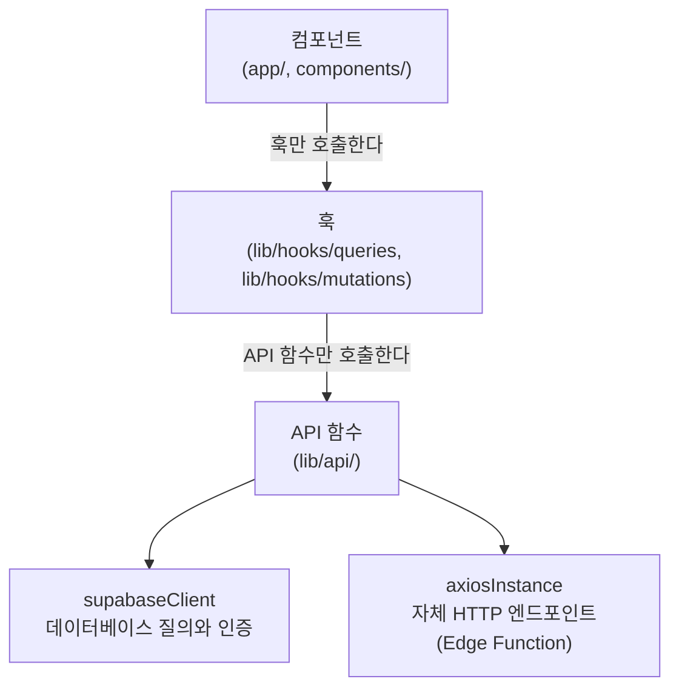

# 오늘 뭐먹지 웹앱

## 프로젝트 소개

사용자의 현재 위치를 기반으로 주변 음식점 한 곳을 추천하는 웹앱입니다. 구글 Places API로 주변 음식점을 검색하고, 개인 평점, 음식 카테고리 기호, 같은 그룹 구성원들의 평균 평점을 가중치로 사용합니다. 그룹은 초대코드로 지인들과 구성할 수 있습니다.

추천에는 가중 랜덤을 적용합니다. 가중 랜덤은 점수가 높은 음식점일수록 뽑힐 확률이 높아지는 무작위 추출 방식입니다.

배포 주소: <https://lunch-recommander.vercel.app>

## 기술 스택

- 프론트엔드: Next.js의 App Router와 TypeScript를 사용합니다. App Router는 파일과 폴더 구조를 기반으로 화면과 경로를 구성하는 Next.js 라우팅 방식입니다.
  - 서버 상태(API 응답)는 React Query가, 폼 상태는 React Hook Form이 관리합니다.
  - 자체 HTTP 엔드포인트인 Edge Function 호출에는 axios를, 데이터베이스 질의와 인증에는 supabase-js SDK를 사용합니다.
- 백엔드: Supabase를 사용합니다.
  - Auth: 사용자 인증을 처리합니다.
  - Postgres와 RLS: 데이터를 저장하고 보호합니다. RLS(Row Level Security)는 행 단위 접근 제어입니다. 로그인한 사용자가 접근할 수 있는 행을 데이터베이스에서 제한합니다.
  - Edge Function: 외부 API 호출과 같은 서버 측 작업을 실행하는 함수입니다. Deno로 작성합니다.
- 외부 서비스:
  - 구글 Places API: 주변 음식점과 평점·가격대·사진 정보를 조회합니다.
  - 구글 Maps JavaScript API: 브라우저에서 지도를 렌더링합니다.
  - Cloudflare Turnstile: 익명 세션 생성, 로그인, 회원가입의 자동화된 요청을 차단합니다.

## 주요 기능

### 추천

- 현재 위치와 검색 반경(100m, 300m, 500m 또는 1km)을 기준으로 주변 음식점 한 곳을 추천합니다.
- 최소 구글 평점(3.5~5.0)과 리뷰 수(10~100개)를 선택할 수 있으며 두 기준을 모두 만족하는 음식점만 추천 후보에 포함합니다. 기본값은 평점 3.5 이상, 리뷰 30개 이상입니다.
- 내 평점과 그룹 구성원들의 평균 평점을 함께 반영하는 하이브리드 평점을 사용합니다.
- 추천 카드에 음식점 이름, 카테고리, 가격대, 거리, 대표 사진을 한국어로 보여줍니다. 카테고리는 저장 키로 쓰는 기계값과 화면 표시용 한글 라벨을 분리해 다룹니다.
- 가격대는 구글 priceLevel 등급을 ₩~₩₩₩₩ 기호로 환산해 보여줍니다. 구글은 실제 메뉴 가격이 아니라 4단계 등급만 제공합니다.
- 대표 사진은 추천된 한 곳에 대해서만 조회합니다. 사진 조회는 별도 과금(GetPhotoMedia)이라 검색 결과 20곳 전부가 아니라 뽑힌 곳만 `place-photo` Edge Function이 해석합니다.
- 메뉴·리뷰·영업시간은 카드의 "메뉴·리뷰 자세히 보기"로 구글 지도 상세 페이지에 연결합니다. `placeId`만 쓰므로 추가 API 비용이 없습니다.
- 별점(1~5)으로 개인 평점을 남기고 "다시 추천 안 함"으로 특정 음식점을 영구 제외합니다. 별점 0점이 곧 영구 제외이므로 별과 분리해 오작동을 막습니다.
- 카테고리 선호도를 별로예요·보통·좋아요 3단계로 받아 추천 가중치에 반영합니다.
- 질린 음식점은 1주 동안 스누즈하여 추천에서 일시 제외하고 기간이 지나면 자동으로 복귀시킵니다.

### 위치

- 고정밀 측위(`enableHighAccuracy`)로 현재 위치를 잡고 빗나갈 때는 지도의 핀을 끌거나 지도를 눌러 직접 보정할 수 있습니다.
- 첫 위치 응답을 기다리는 동안에는 서울 기본 지도를 먼저 표시하고 위치가 확인되면 지도 중심과 핀을 현재 위치로 옮깁니다.
- 위치 요청이 실패하면 경고를 눌러 권한을 다시 요청할 수 있습니다. 브라우저에서 권한을 영구 차단한 경우에는 설정에서 위치 권한을 허용하도록 안내합니다.
- 추천·로그인·저장 등 비동기 작업 중에는 공통 스피너로 진행 상태를 표시합니다.

### 그룹

- 초대코드를 기반으로 그룹을 만들고 지인을 연결합니다.

### 회원가입(이메일 인증)

- 이메일과 비밀번호를 입력하면 Supabase Auth가 인증 메일을 보냅니다. 사용자가 인증 링크를 누르면 홈으로 이동하며 로그인 세션이 생성됩니다.
- 익명 세션, 로그인, 회원가입은 모두 Cloudflare Turnstile 토큰을 Supabase Auth에 전달해 서버에서 검증합니다.
- 회원가입은 세션을 저장하지 않는 별도 Supabase 클라이언트에서 요청하므로, 인증 메일을 기다리는 동안 기존 익명 세션으로 추천을 계속 사용할 수 있습니다.

### 보안·요금 방어

- 유료 Places 호출은 Edge Function에서 사용자 ID와 IP를 함께 기준으로 제한합니다. 가입 전 Auth 요청은 Supabase Auth의 IP 기반 rate limit과 Turnstile을 함께 적용합니다. 프론트엔드만으로 제한하지 않아 스팸 요청으로 인한 Supabase 및 구글 API 과금을 방어합니다.
- 구글 Places API 호출은 Edge Function을 통해 처리하여 서버용 API 키가 브라우저에 노출되지 않도록 합니다.
- 구글 Places 호출 결과는 15분 동안 캐시하여 동일 위치의 반복 호출을 줄입니다.
- 익명 사용자도 PostgreSQL의 `authenticated` 역할을 사용하지만, `0007_block_anonymous_writes.sql`의 restrictive RLS 정책이 평점·기호·그룹 쓰기를 차단합니다.

## 아키텍처 메모

### 프론트엔드 데이터 레이어

화면 컴포넌트는 데이터 접근 코드를 직접 갖지 않고 레이어를 거칩니다. 의존 방향은 아래 한 방향뿐입니다.



식별자(쿠키명·테이블·경로 등)는 `lib/constants.ts`, 사용자 노출 문구는 `lib/messages.ts`로 각각 단일화합니다.

### Edge Function

- `nearby`: 주변 음식점을 조회합니다. 캐시가 없으면 구글 Places를 호출하고 결과를 캐시합니다.
- `place-photo`: 추천된 음식점의 대표 사진 URL을 조회합니다. 서버용 키를 노출하지 않기 위해 이미지 URL 해석을 서버에서 처리합니다.

## 배포 상태

- 프론트엔드: Vercel에 배포되어 있으며 `main` 병합 시 자동 배포됩니다. Pull Request에는 프리뷰 배포가 생성됩니다.
- 백엔드: Supabase 클라우드 프로젝트를 사용합니다. 마이그레이션과 Edge Function은 CLI로 수동 배포합니다.
- CI: `main` push와 Pull Request에서 프론트엔드 테스트·타입체크·린트·빌드와 Edge Function 테스트를 실행합니다(`.github/workflows/ci.yml`). `main`은 직접 push를 막고 상태 검사 통과를 필수로 합니다.

## 로컬 실행

### 1. 사전 요구 사항

다음 도구가 설치되어 있어야 합니다.

- Node.js
- Deno
- Supabase CLI
- Docker: 로컬 Supabase를 기동할 때 사용합니다.

### 2. 의존성 설치

```bash
npm install
```

### 3. Cloudflare Turnstile 준비

Cloudflare Turnstile 사이트를 만들고 `localhost`, `127.0.0.1`, 실제 배포 도메인을 허용합니다. 발급된 site key는 다음 단계의 브라우저 환경변수에, secret key는 Supabase Auth에만 설정합니다.

로컬 Supabase를 실행하는 셸에는 secret을 설정합니다. 이 값은 `.env.local`이나 `NEXT_PUBLIC_` 환경변수에 넣지 않습니다.

```bash
export SUPABASE_AUTH_CAPTCHA_SECRET=<Cloudflare Turnstile secret key>
```

### 4. 로컬 Supabase 기동

```bash
npx supabase start
```

명령 출력에 표시된 API URL과 anon 키를 다음 단계의 환경변수에 사용합니다.

### 5. 환경변수 설정

프로젝트 루트에 `.env.local`을 만들고 `.env.local.example`을 참고하여 다음 값을 채웁니다. 네 값 모두 브라우저에 노출되는 공개 값입니다.

```dotenv
NEXT_PUBLIC_SUPABASE_URL=<Supabase API URL>
NEXT_PUBLIC_SUPABASE_ANON_KEY=<Supabase anon key>
NEXT_PUBLIC_GOOGLE_MAPS_KEY=<Google Maps JavaScript API key>
NEXT_PUBLIC_TURNSTILE_SITE_KEY=<Cloudflare Turnstile site key>
```

- `NEXT_PUBLIC_SUPABASE_ANON_KEY`는 브라우저 노출이 허용되는 키이며, 데이터 접근은 RLS 정책으로 보호합니다.
- `NEXT_PUBLIC_GOOGLE_MAPS_KEY`는 지도 렌더링용 키입니다. 허용된 도메인에서만 사용할 수 있도록 HTTP referrer 제한을 설정해야 합니다.
- `NEXT_PUBLIC_TURNSTILE_SITE_KEY`는 위젯 렌더링용 공개 키입니다. Turnstile secret과 혼동하면 안 됩니다.

민감한 키는 브라우저에 노출하지 않고 Supabase Dashboard나 Edge Function 시크릿처럼 서버 측 설정으로만 보관합니다.

- `GOOGLE_PLACES_API_KEY`: 서버용 Places 키. `VITE_`, `NEXT_PUBLIC_`처럼 클라이언트에 노출되는 접두사를 사용해서는 안 됩니다.

로컬에서 Edge Function 시크릿을 설정하려면 다음처럼 실행합니다.

```bash
npx supabase secrets set GOOGLE_PLACES_API_KEY=<...>
```

AWS 또는 GCP 등 과금 가능한 클라우드 서비스를 사용할 때는 코드 외부에서 예산 알림(Budget Alert)과 할당량 상한을 설정해야 합니다.

### 6. Supabase Auth 운영 설정

Supabase Dashboard에서 다음을 설정합니다.

- Authentication > Email에서 이메일 가입과 이메일 확인을 활성화합니다.
- Authentication > URL Configuration의 Site URL을 실제 배포 주소로 설정하고 Redirect URL에 실제 배포 주소와 필요한 Vercel Preview 주소를 정확히 등록합니다.
- Authentication > Bot and Abuse Protection에서 Cloudflare Turnstile을 선택하고 secret key를 저장합니다.
- Auth의 로그인·가입·익명 사용자 IP rate limit과 인증 메일 발송 한도를 서비스 규모에 맞게 확인합니다.
- 실제 주소로 가입한 뒤 인증 링크를 열어 홈에서 비익명 로그인 상태가 되는지 smoke test합니다.

### 7. 개발 서버 실행

```bash
npm run dev
```

### 8. 테스트

프론트엔드 테스트를 실행합니다.

```bash
npm test
```

Edge Function 테스트를 실행합니다. Deno 테스트는 `supabase/functions` 디렉터리 안에서 실행해야 리포지토리 루트의 `node_modules`가 오염되지 않습니다.

```bash
cd supabase/functions && deno test --no-check --allow-env --node-modules-dir=auto
```

로컬 데이터베이스를 초기화한 뒤 DB pgTAP 테스트를 실행합니다. pgTAP은 PostgreSQL 데이터베이스 동작을 검증하는 테스트 도구입니다.

```bash
npx supabase db reset && npx supabase test db
```

## 배포

프론트엔드는 `main` 병합 시 Vercel이 자동 배포합니다. 백엔드는 다음처럼 수동 배포합니다.

```bash
npx supabase functions delete signup-request
npx supabase functions delete approve-signup
npx supabase functions list
npx supabase db push
npx supabase functions deploy nearby place-photo
```

앞의 두 삭제 명령은 기존 관리자 승인 함수를 배포했던 프로젝트에서 한 번만 실행합니다. 소스와 배포 명령에서 함수를 제외해도 원격 함수는 자동 삭제되지 않으므로, `functions list` 결과에 두 함수가 없는지 확인한 뒤 승인용 테이블 제거 마이그레이션을 배포합니다.

## 남은 작업

### GCP 요금 방어 마무리

- [ ] Vercel 프리뷰 배포 도메인이 필요하면 Maps JS 브라우저 키 referrer에 추가합니다. 현재는 배포 도메인과 localhost만 허용되어 있습니다.
- [ ] Places 서버 키의 IP 제한은 두지 않았습니다. Supabase Edge Function은 고정 outbound IP가 없어 IP 제한이 비현실적이며 API 제한(Places만) · 시크릿 비노출 · 사용량 제한 3중 방어로 갈음합니다.

### 후속 개선(병합 차단 아님)

- [ ] 회원가입 인증 메일은 Supabase 내장 발송을 사용합니다. 발송량이 내장 한도를 넘으면 Supabase Auth에 별도 SMTP를 설정해야 하며 이때는 발신 도메인 인증이 필요합니다.
- [ ] 지도 마커는 `google.maps.Marker`를 사용합니다. 후속 대체재인 `AdvancedMarkerElement`는 GCP 콘솔에서 발급하는 Map ID가 필요해 별도로 다룹니다.
- [ ] 서버 렌더링에서 민감 데이터를 다루게 되면 `@supabase/ssr`로 전환하여 서버에서 실제 세션과 JWT를 검증합니다. 현재 `sb-session` 마커 쿠키는 사용자 경험을 위한 가드이며 실제 데이터 보호는 RLS가 담당합니다.

## 설계 문서

- 스펙: [`docs/superpowers/specs/2026-07-21-lunch-recommender-design.md`](docs/superpowers/specs/2026-07-21-lunch-recommender-design.md)
- 구현 계획: [`docs/superpowers/plans/2026-07-21-lunch-recommender.md`](docs/superpowers/plans/2026-07-21-lunch-recommender.md)
- 이메일 인증 회원가입: [`docs/superpowers/specs/2026-07-25-email-verification-signup-design.md`](docs/superpowers/specs/2026-07-25-email-verification-signup-design.md)
- 이메일 인증 회원가입 구현 계획: [`docs/superpowers/plans/2026-07-25-email-verification-signup.md`](docs/superpowers/plans/2026-07-25-email-verification-signup.md)
- 프론트엔드 데이터 레이어: [`docs/superpowers/specs/2026-07-23-fe-data-layer-refactor-design.md`](docs/superpowers/specs/2026-07-23-fe-data-layer-refactor-design.md)
- 대체된 설계 — 관리자 승인 회원가입: [`docs/superpowers/specs/2026-07-23-signup-approval-design.md`](docs/superpowers/specs/2026-07-23-signup-approval-design.md)
- 대체된 설계 — 관리자 알림 채널(Discord): [`docs/superpowers/specs/2026-07-24-admin-notify-discord-design.md`](docs/superpowers/specs/2026-07-24-admin-notify-discord-design.md)
