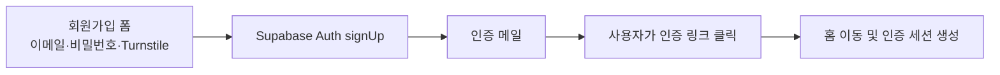

# 이메일 인증 회원가입 전환 설계

**작성일:** 2026-07-25  
**대상:** 로그인·회원가입 UI, Supabase Auth, 관리자 승인 Edge Function, 승인용 DB 테이블  
**대체 대상:** [`2026-07-23-signup-approval-design.md`](./2026-07-23-signup-approval-design.md), [`2026-07-24-admin-notify-discord-design.md`](./2026-07-24-admin-notify-discord-design.md)

## 1. 배경

현재 회원가입은 이메일 요청, Discord 관리자 알림, 관리자 승인, Supabase 초대 메일,
비밀번호 설정 순서로 진행됩니다. 소규모 서비스에서 이 과정은 운영자 개입과 사용자 대기를
발생시킵니다.

회원가입을 Supabase Auth의 기본 이메일·비밀번호 가입으로 전환합니다. 사용자는 가입 폼에서
이메일과 비밀번호를 입력하고, 인증 메일 링크를 클릭하면 홈으로 돌아와 로그인된 상태가 됩니다.



## 2. 목표와 비목표

### 목표

- 관리자의 개입 없이 이메일 소유권 확인만으로 가입을 완료합니다.
- 이메일과 비밀번호는 가입 시 한 번에 입력합니다.
- 인증 링크 클릭 후 홈으로 이동하고 인증된 세션을 사용합니다.
- Cloudflare Turnstile과 Supabase Auth의 서버 측 CAPTCHA 검증으로 자동 가입·로그인 시도를 방어합니다.
- 관리자 승인 흐름의 화면, API, Edge Function, Discord 알림 및 DB 테이블을 제거합니다.
- 기존 과거 마이그레이션과 설계 문서는 이력으로 보존합니다.

### 비목표

- 비밀번호 재설정, 소셜 로그인, 매직 링크 로그인을 추가하지 않습니다.
- 익명 사용자와 기존 계정의 데이터를 병합하지 않습니다.
- 기존 추천·평점·그룹 데이터 스키마와 RLS 정책을 변경하지 않습니다.
- 별도 SMTP를 이번 작업에서 설정하지 않습니다.

## 3. 주요 설계 결정

### 3.1 Supabase 기본 이메일 가입을 사용합니다

프론트엔드 API 계층에서 `supabase.auth.signUp()`을 호출합니다.

```ts
supabase.auth.signUp({
  email,
  password,
  options: {
    captchaToken,
    emailRedirectTo: `${location.origin}/`,
  },
});
```

민감한 서비스 키는 필요하지 않습니다. 브라우저 노출이 허용된 Supabase publishable/anon 키로
Auth 서비스에 요청하고, 비밀번호 저장·해싱·인증 메일 발송은 Supabase Auth가 담당합니다.

이메일 확인 기능은 Supabase Dashboard와 로컬 `supabase/config.toml`에서 활성화합니다.
인증 메일 링크의 redirect URL은 로컬 주소와 실제 Vercel 배포 주소만 허용합니다.

### 3.2 익명 세션은 가입 전에 종료합니다

앱은 방문자에게 익명 Supabase 사용자를 발급합니다. Supabase가 익명 사용자를 같은 ID의 영구
사용자로 전환하는 공식 흐름은 이메일을 먼저 연결하고 인증한 뒤 비밀번호를 별도로 추가합니다.
이는 “이메일과 비밀번호를 한 번에 입력”하는 요구사항과 맞지 않습니다.

따라서 가입 요청 직전에 현재 사용자가 익명인지 확인하고 익명 세션만 로그아웃한 뒤 새 계정을
만듭니다. 실사용자 세션에서는 회원가입 폼을 사용할 이유가 없으므로 기존 계정을 로그아웃시키지
않습니다.

익명 사용자는 RLS에 의해 평점·기호 같은 영구 쓰기를 할 수 없으므로 보존할 사용자 데이터가
없습니다. 추천 호출용 임시 ID와 사용량 기록은 새 계정으로 승계하지 않습니다.

이메일 확인이 활성화된 `signUp()`은 가입 요청 성공 시에도 인증 전까지 실사용자 세션을 만들지
않습니다. 따라서 가입 성공·실패와 관계없이 요청이 끝난 뒤 현재 세션이 없으면
`ensureSession()`으로 새 익명 세션을 즉시 발급합니다. 사용자는 인증 메일을 기다리는 동안에도
추천 기능을 계속 쓸 수 있습니다. 인증 링크가 열리면 Supabase가 URL의 인증 정보를 처리해 이
익명 세션을 실사용자 세션으로 교체합니다.

### 3.3 CAPTCHA는 로그인과 가입 모두 적용합니다

Supabase Dashboard에서 Cloudflare Turnstile CAPTCHA 보호를 활성화하면 Auth 로그인과 가입
요청이 토큰을 요구합니다. 따라서 로그인 폼과 가입 폼 모두 Turnstile 토큰을 API 요청에
포함합니다.

Cloudflare가 권장하는 `@marsidev/react-turnstile`을 사용해 공통 `AuthTurnstile` 컴포넌트를
만듭니다.

- site key: `NEXT_PUBLIC_TURNSTILE_SITE_KEY`
- secret key: Supabase Dashboard에만 저장
- 성공: 토큰을 폼 상태에 기록
- 만료·오류: 토큰을 비우고 제출 차단
- Auth 요청 완료: 위젯을 reset하여 일회용 토큰 재사용 방지

사이트 키가 없으면 운영에서 CAPTCHA 없이 조용히 진행하지 않습니다. 폼에 설정 오류를 표시하고
제출을 막습니다. 테스트에서는 Cloudflare의 공식 테스트 사이트 키 또는 컴포넌트 모킹을 사용합니다.

### 3.4 동일한 가입 성공 문구를 사용합니다

이메일 인증이 활성화된 Supabase는 이미 가입된 이메일에 대해 계정 존재 여부를 숨기는 응답을
돌려줄 수 있습니다. 화면에서도 응답 세부 정보로 가입 여부를 구분하지 않고 다음 문구만 표시합니다.

> 인증 메일을 확인해 주세요.

오류가 발생하면 Supabase가 반환한 안전한 사용자용 메시지를 표시합니다. CAPTCHA 만료와 비밀번호
불일치는 프론트엔드에서 구체적으로 안내합니다.

## 4. 컴포넌트와 데이터 레이어

### 4.1 타입과 API

`lib/types/api/auth.types.ts`

- `SignInRequest`: `email`, `password`, `captchaToken`
- `SignupRequest`: `email`, `password`, `captchaToken`

`lib/api/auth.ts`

- `signIn()`: 기존 로그인 요청에 CAPTCHA 토큰을 전달
- `signUp()`: 익명 세션 종료, 이메일 가입, 홈 redirect 지정, 요청 후 익명 세션 복구
- 관리자 승인 요청용 axios 호출과 응답 타입 제거
- 초대 세션 확인과 초대 비밀번호 설정 함수 제거

### 4.2 React Query 훅

`lib/hooks/mutations/useAuthMutations.ts`

- `useSignUp`을 `signUp()` API 함수에 연결
- 기존 `useRequestSignup`, `useUpdatePassword` 제거
- 로그인·가입 성공 시 인증 주체가 바뀔 수 있으므로 Query Client 캐시를 비움

초대 세션 전용 `useAuthQueries.ts`는 제거합니다.

### 4.3 UI

`app/login/page.tsx`

- 로그인 폼에 Turnstile 추가
- “회원가입 요청”을 “회원가입”으로 변경
- 가입 dialog에 이메일, 비밀번호, 비밀번호 확인, Turnstile 추가
- 비밀번호 최소 길이 8과 확인값 일치를 검증
- CAPTCHA 토큰이 없으면 제출 차단
- 가입 성공 시 dialog 안에서 인증 메일 확인 문구 표시

공통 `AuthTurnstile`은 토큰 전달, 만료·오류 알림, reset 인터페이스만 담당합니다.
로그인과 가입의 폼 상태·문구 선택은 페이지가 담당합니다.

## 5. 관리자 승인 흐름 제거

사용자가 삭제를 승인한 범위는 다음과 같습니다.

- `app/admin/approve/`
- `app/set-password/`
- `supabase/functions/signup-request/`
- `supabase/functions/approve-signup/`
- `supabase/functions/_shared/notify.ts`와 테스트
- `supabase/functions/_shared/token.ts`와 테스트
- `lib/api/signupApproval.ts`와 테스트
- `lib/hooks/queries/useSignupApprovalQueries.ts`
- `lib/hooks/mutations/useSignupApprovalMutations.ts`
- `lib/types/api/signupApproval.types.ts`
- 관련 배럴 export, 상수, 문구

`supabase/config.toml`에서 제거된 Edge Function의 `verify_jwt` 예외 설정이 있으면 함께 제거합니다.
README의 Edge Function 배포 명령과 Discord Secret 설명도 현재 구조에 맞게 갱신합니다.

과거 설계·계획 문서와 과거 마이그레이션은 의사결정 이력으로 남기며 삭제하지 않습니다. README에서
과거 설계 문서는 “대체된 설계”로 표시하거나 최신 설계 문서 아래에 이력으로 구분합니다.

## 6. 데이터베이스 마이그레이션과 RLS 검토

새 순번의 마이그레이션에서 아래 테이블을 제거합니다.

```sql
drop table if exists public.signup_attempts;
drop table if exists public.signup_requests;
```

두 테이블 사이 외래 키는 없으며 각 테이블의 인덱스, RLS 정책, 권한은 테이블 삭제와 함께
제거됩니다. 과거 마이그레이션을 수정하지 않아 새 환경에서는 생성 후 제거되는 동일한 최종 상태를
재현할 수 있습니다.

민감 데이터와 사용량 데이터는 기존에도 `signup_requests`와 `signup_attempts`로 분리되어
있었습니다. 두 데이터 모두 더 이상 수집 목적이 없으므로 보존하지 않고 제거합니다.

RLS 우회 검토:

- 새 public 테이블을 만들지 않습니다.
- 기존 추천·평점·그룹 테이블의 정책은 변경하지 않습니다.
- 승인용 service role 접근 경로와 테이블 자체가 사라집니다.
- 익명 사용자는 계속 `authenticated` 역할을 사용하므로 기존 restrictive RLS 검사는 유지되어야 합니다.

## 7. 외부 설정

코드만으로 완료할 수 없는 Supabase·Cloudflare 설정입니다.

### Cloudflare

- Turnstile 사이트 생성
- localhost와 실제 배포 도메인 등록
- site key를 Vercel `NEXT_PUBLIC_TURNSTILE_SITE_KEY`에 설정

### Supabase Dashboard

- Authentication > Email에서 이메일 확인 활성화
- Authentication > URL Configuration에서 Site URL과 Redirect URL 허용 목록 설정
- Authentication > Bot and Abuse Protection에서 Turnstile 활성화
- Turnstile secret key 저장
- Auth의 sign-in/sign-up 및 email 발송 rate limit 확인

Turnstile secret은 코드, `.env.local.example`, `NEXT_PUBLIC_` 환경변수에 넣지 않습니다.
외부 설정이 완료되지 않으면 배포 환경의 회원가입과 로그인이 동작하지 않으므로 PR 체크리스트에
수동 설정 항목을 포함합니다.

## 8. 테스트 전략

### API 단위 테스트

- 로그인 요청에 CAPTCHA 토큰 전달
- 익명 세션만 로그아웃한 뒤 가입
- 실사용자 세션은 로그아웃하지 않고 가입 거부
- 가입 요청에 이메일, 비밀번호, CAPTCHA 토큰, 홈 redirect 전달
- 가입 성공·실패 후 세션이 없으면 익명 세션 복구
- Supabase 오류를 예외로 승격

### UI 테스트

- 로그인과 가입 폼에 Turnstile 표시
- CAPTCHA 전에는 제출 차단
- CAPTCHA 성공 후 로그인·가입 요청 가능
- 비밀번호 최소 길이와 확인값 불일치 안내
- 가입 성공 시 인증 메일 안내
- Auth 요청 후 CAPTCHA reset
- 로그인과 가입 오류 표시

### 삭제·마이그레이션 검증

- 제거 대상 화면, API, 훅, Edge Function import가 남지 않음
- `supabase db reset`으로 전체 마이그레이션 적용 성공
- 최종 스키마에 `signup_requests`, `signup_attempts`가 없음
- Edge Function 테스트와 프론트 전체 테스트 통과

## 9. 완료 기준

- 사용자는 관리자 승인 없이 이메일·비밀번호와 메일 인증만으로 가입할 수 있습니다.
- 인증 링크 클릭 후 홈에서 로그인 상태가 됩니다.
- 로그인과 가입 모두 유효한 Turnstile 토큰을 요구합니다.
- Discord 웹훅과 관리자 승인 코드·화면·테이블이 제거됩니다.
- 과거 마이그레이션과 과거 설계 문서는 보존됩니다.
- DB/RLS/RBAC 변경 범위가 승인용 자원 제거에만 한정됩니다.
- 타입 검사, 린트, 전체 테스트, 변경 파일 포맷 검사, 프로덕션 빌드가 통과합니다.
