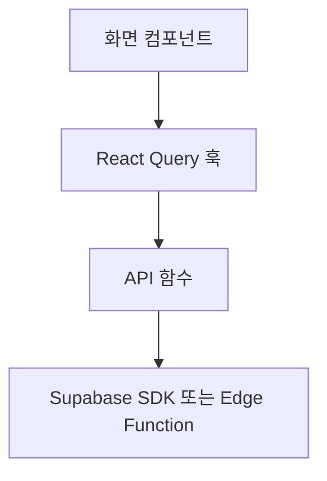

# 프론트엔드 데이터 레이어 후속 리팩터링 설계

**작성일:** 2026-07-25  
**대상:** `app/set-password`, `app/admin/approve`, `lib/api`, `lib/hooks`, `lib/types/api`  
**관련 문서:** [`2026-07-23-fe-data-layer-refactor-design.md`](./2026-07-23-fe-data-layer-refactor-design.md)

## 1. 배경

기존 프론트엔드 데이터 레이어 리팩터링으로 대부분의 화면은 아래 의존 방향을 따릅니다.

다만 `app/set-password/page.tsx`와 `app/admin/approve/page.tsx`에는 Supabase 호출이
직접 남아 있습니다. 이 예외를 제거해 데이터 접근 경계와 오류 처리를 기존 구조에 맞춥니다.

## 2. 목표와 비목표

### 목표

- 두 페이지에서 `supabaseClient` 직접 import를 제거합니다.
- 외부 통신은 `lib/api`, 서버 상태는 React Query 훅이 담당하게 합니다.
- 요청·응답 타입을 `lib/types/api`에서 관리합니다.
- 현재 UI, 사용자 문구, 화면 이동, 로딩 및 중복 제출 방지 동작을 보존합니다.
- 테스트가 Supabase 구현 세부사항이 아니라 페이지가 사용하는 훅 경계를 기준으로 동작하게 합니다.

### 비목표

- 화면 디자인과 CSS를 변경하지 않습니다.
- Supabase Edge Function의 구현이나 API 계약을 변경하지 않습니다.
- 데이터베이스 스키마, RLS 정책, RBAC를 변경하지 않습니다.
- SMTP, `AdvancedMarkerElement`, `@supabase/ssr` 후속 작업을 포함하지 않습니다.
- 기존 인증 흐름이나 관리자 승인 권한 모델을 변경하지 않습니다.

## 3. 설계

### 3.1 비밀번호 설정

비밀번호 설정은 기존 `auth` 도메인에 포함합니다.

- `lib/api/auth.ts`
  - 현재 세션이 초대받은 실사용자 세션인지 확인하는 함수를 추가합니다.
  - 새 비밀번호를 Supabase Auth에 저장하는 함수를 추가합니다.
  - Supabase의 `{ error }`는 기존 `assertNoError`로 예외로 승격합니다.
- `lib/hooks/queries/useAuthQueries.ts`
  - 초대 세션 유효성을 읽는 쿼리를 제공합니다.
- `lib/hooks/mutations/useAuthMutations.ts`
  - 비밀번호 변경 뮤테이션을 제공합니다.
- `lib/types/api/auth.types.ts`
  - 비밀번호 변경 요청 타입을 추가합니다.

페이지는 쿼리의 `isPending`, `data`, `error`와 뮤테이션의 `isPending`, `isSuccess`,
`error`를 사용합니다. 성공 후 홈 이동은 UI 후처리이므로 기존 원칙대로 페이지가 담당합니다.

초대 세션 판정은 현재 동작을 그대로 유지합니다.

- 세션 없음: 유효하지 않은 진입
- 익명 사용자 세션: 유효하지 않은 진입
- 비익명 사용자 세션: 비밀번호 설정 허용

세션 확인 중 예외에는 기존 안내 문구
`초대 정보를 확인하지 못했습니다. 다시 시도해 주세요.`를 표시합니다.
비밀번호 변경에서 Supabase가 반환한 오류 문구는 그대로 표시하며, 예상하지 못한 예외에는
기존 대체 문구를 표시합니다.

### 3.2 관리자 회원가입 승인

관리자 승인 기능은 일반 인증과 수명주기 및 응답 타입이 다르므로 별도
`signupApproval` 도메인으로 분리합니다.

- `lib/api/signupApproval.ts`
  - 토큰으로 승인 요청 정보를 조회합니다.
  - 토큰과 `approve` 또는 `reject` 액션으로 결정을 제출합니다.
  - 기존 `approve-signup` Edge Function 호출을 감쌉니다.
- `lib/hooks/queries/useSignupApprovalQueries.ts`
  - 토큰별 승인 요청 조회 쿼리를 제공합니다.
- `lib/hooks/mutations/useSignupApprovalMutations.ts`
  - 승인·거절 결정을 제출하는 뮤테이션을 제공합니다.
- `lib/types/api/signupApproval.types.ts`
  - 조회 응답, 액션, 결정 응답 타입을 정의합니다.

조회 쿼리 키에는 토큰을 포함해 서로 다른 승인 링크의 결과가 섞이지 않게 합니다.
결정 성공 후 버튼을 숨기고 결과 문구를 표시하는 동작은 페이지가 담당합니다.
결정 완료 후 별도 재조회는 하지 않습니다. 현재 화면은 성공 결과만 표시하고 끝나므로
추가 네트워크 요청 없이 기존 동작을 보존하는 편이 단순합니다.

### 3.3 오류와 로딩 상태

- API 함수는 Supabase 오류를 `Error`로 승격합니다.
- React Query는 오류와 pending 상태를 관리합니다.
- 페이지는 사용자 문구 선택과 화면 렌더링만 담당합니다.
- 공통 `Spinner`와 기존 `aria-busy`, `role="status"`, `role="alert"`를 유지합니다.
- pending 또는 성공 상태에서는 기존과 같이 중복 제출을 막습니다.

### 3.4 배럴 export

새 API, 타입, 쿼리 훅, 뮤테이션 훅은 각 디렉터리의 기존 `index.ts`에서 export합니다.
페이지는 배럴 경로를 사용해 내부 파일 배치를 알지 않도록 합니다.

## 4. 보안 검토

- 이번 작업은 프론트엔드 호출 경로만 정리하며 권한을 추가하거나 완화하지 않습니다.
- 관리자 승인 권한 검증은 기존 `approve-signup` Edge Function에서 계속 수행되어야 합니다.
  프론트엔드 훅은 보안 경계가 아닙니다.
- 비밀번호 변경은 Supabase Auth가 현재 세션과 초대 토큰을 검증하는 기존 경로를 유지합니다.
- 민감한 서비스 키를 클라이언트에 추가하지 않습니다.
- DB 테이블을 만들거나 변경하지 않으므로 RLS 정책 및 사용자 데이터 접근 경로에는 변화가 없습니다.
- 구독 상태나 사용량 제한 데이터를 추가하거나 혼재시키지 않습니다.
- 외부 유료 API 호출을 추가하지 않으므로 rate limit 및 과금 구조에는 변화가 없습니다.

## 5. 테스트 전략

기존 사용자 관점 어설션은 유지합니다.

- 비밀번호 설정
  - 세션 없음과 익명 세션 차단
  - 성공 시 홈 이동
  - Supabase 오류와 예상하지 못한 오류 표시
  - 성공 후 및 pending 중 중복 제출 차단
  - 공통 스피너와 입력 제약 유지
- 관리자 승인
  - 이메일과 상태 표시
  - 조회 중 공통 스피너 표시
  - 승인·거절 결과 표시 및 재제출 차단
  - 만료·무효 토큰 오류 표시

페이지 테스트에서는 데이터 훅을 모킹합니다. API 함수에는 Supabase 호출 인자와 오류 승격을
검증하는 단위 테스트를 추가해, 페이지 테스트에서 빠지는 외부 통신 계약을 보완합니다.

## 6. 완료 기준

- 두 페이지가 `supabaseClient`를 직접 import하지 않습니다.
- 데이터 접근이 `페이지 → React Query 훅 → API 함수 → Supabase` 방향을 따릅니다.
- 기존 106개 테스트를 포함한 전체 테스트가 통과합니다.
- `npm run typecheck`, `npm run lint`, `npm run format:check`, `npm run build`가 통과합니다.
- README의 후속 개선 두 번째 항목만 완료 처리하고 다른 항목은 변경하지 않습니다.
