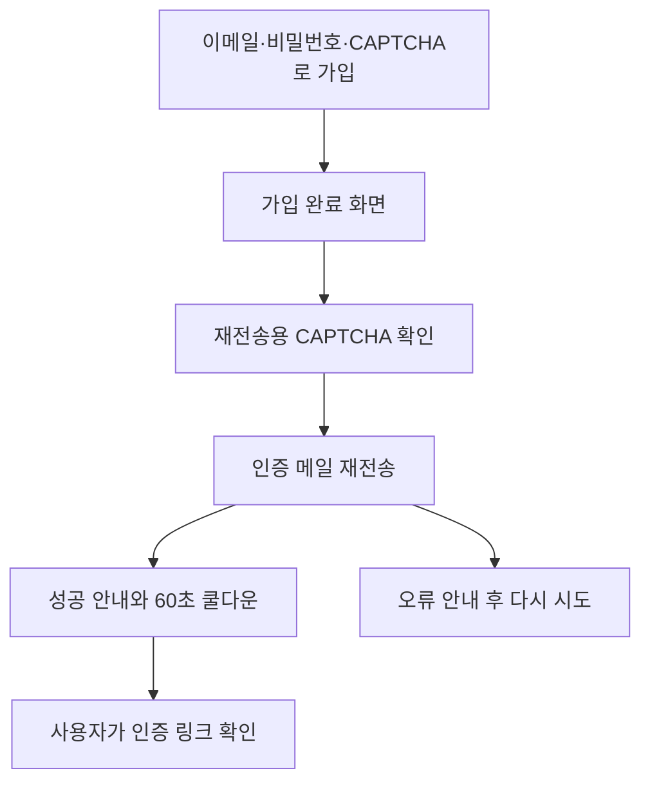

# 회원가입 인증 메일 재전송 설계

**작성일:** 2026-07-25  
**대상:** 회원가입 완료 UI, Supabase Auth API, React Query 인증 mutation  
**선행 설계:** [`2026-07-25-email-verification-signup-design.md`](./2026-07-25-email-verification-signup-design.md)

## 1. 배경

현재 사용자는 회원가입 요청이 성공하면 “인증 메일을 확인해 주세요.”라는 안내만 받습니다.
메일이 지연되거나 누락된 경우 같은 화면에서 다시 받을 방법이 없어 가입을 처음부터 반복해야
합니다.

가입 완료 화면에서 방금 가입한 이메일로 인증 메일을 다시 보낼 수 있게 합니다. 재전송 요청도
Cloudflare Turnstile을 거쳐 Supabase Auth가 검증하며, 화면의 쿨다운은 서버 측 이메일 발송 제한을
대체하지 않고 반복 클릭을 줄이는 UX 보조 수단으로만 사용합니다.

## 2. 목표와 비목표

### 목표

- 가입 성공 후 비밀번호 입력 폼 대신 인증 메일 완료 화면을 표시합니다.
- 가입 요청에 사용한 이메일을 완료 화면에 표시하고 재전송 대상으로 고정합니다.
- CAPTCHA 검증 후 Supabase의 가입 확인 메일 재전송 API를 호출합니다.
- 재전송 요청 중 공통 스피너를 표시합니다.
- 성공 후 60초 동안 남은 시간을 표시하고 재전송 버튼을 비활성화합니다.
- 성공과 실패 결과를 접근 가능한 상태·오류 메시지로 표시합니다.
- 모달을 닫았다가 다시 열면 가입과 재전송 상태를 모두 초기화합니다.

### 비목표

- 로그인 화면에 독립적인 “인증 메일 재전송” 찾기 기능을 추가하지 않습니다.
- 사용자가 완료 화면에서 재전송 이메일 주소를 변경하게 하지 않습니다.
- 프론트엔드 쿨다운을 보안용 rate limit으로 취급하지 않습니다.
- Supabase의 서버 측 이메일 발송 제한값을 변경하지 않습니다.
- 별도 Edge Function이나 데이터베이스 테이블을 추가하지 않습니다.

## 3. 사용자 흐름



가입 성공 전에는 현재 회원가입 폼을 그대로 사용합니다. 성공하면 가입 폼을 숨기고 다음 내용을
표시합니다.

- `{email}로 인증 메일을 보냈습니다.`
- 메일함과 스팸함 확인 안내
- 재전송용 Turnstile
- `인증 메일 재전송` 버튼
- `닫기` 버튼

재전송 버튼은 CAPTCHA 토큰이 없거나 요청 중이거나 쿨다운 중일 때 비활성화합니다. 요청 중에는
공통 `Spinner`와 “재전송 중…”을 표시합니다. 성공하면 CAPTCHA를 초기화하고
“인증 메일을 다시 보냈습니다.”를 표시합니다. 쿨다운 중 버튼 문구는
`60초 후 재전송`부터 1초 단위로 갱신합니다.

## 4. 데이터 흐름

### 4.1 API

`lib/api/auth.ts`에 재전송 함수를 추가합니다.

```ts
signupSupabase.auth.resend({
  type: 'signup',
  email,
  options: {
    captchaToken,
    emailRedirectTo,
  },
});
```

가입과 동일한 비영속 Supabase 클라이언트를 사용해 현재 익명 세션에 영향을 주지 않습니다. 요청은
이메일, 일회용 CAPTCHA 토큰, 홈 redirect URL만 받습니다. Supabase 오류는 기존 API 오류 처리
방식대로 예외로 승격합니다.

### 4.2 React Query

`lib/hooks/mutations/useAuthMutations.ts`에 전용 mutation을 추가합니다. 재전송은 인증 주체나
애플리케이션 데이터가 바뀌지 않으므로 Query Client 캐시는 비우지 않습니다.

### 4.3 화면 상태

로그인 페이지는 가입 성공 당시의 이메일을 별도 상태로 저장합니다. 이후 입력 필드가 바뀌더라도
재전송 대상은 이 값만 사용합니다. 재전송 mutation의 성공·오류 상태, CAPTCHA 토큰, 쿨다운 남은
시간은 가입 모달이 닫힐 때 초기화합니다.

쿨다운 타이머는 활성 상태에서만 1초 간격으로 감소시키고 0이 되면 정리합니다. 모달이 닫히거나
컴포넌트가 해제될 때 interval을 정리해 백그라운드 갱신을 남기지 않습니다.

## 5. 오류 처리와 보안

- CAPTCHA 토큰이 없으면 재전송 요청을 호출하지 않습니다.
- 요청이 완료되면 성공·실패 여부와 관계없이 Turnstile을 reset하여 토큰 재사용을 막습니다.
- Supabase가 반환한 rate limit 및 CAPTCHA 오류를 기존 `errorMessage()`로 표시합니다.
- 이메일 주소는 가입 성공 시 사용한 값으로 고정하고 임의의 주소 발송 UI를 제공하지 않습니다.
- 60초 프론트엔드 쿨다운은 UX 제어일 뿐입니다. 실제 남용 방지는 Supabase Auth가 서버에서
  적용하는 CAPTCHA 및 이메일 발송 rate limit에 의존합니다.
- 민감한 키나 새 클라이언트 노출 환경변수를 추가하지 않습니다.

## 6. 테스트 전략

### API 테스트

- `type: 'signup'`, 이메일, CAPTCHA 토큰, redirect URL을 `auth.resend()`에 전달합니다.
- Supabase 오류를 예외로 반환합니다.

### mutation 테스트

- API 함수에 요청값을 전달하고 성공 결과를 반환합니다.
- 재전송 성공 시 기존 Query Client 캐시를 지우지 않습니다.

### UI 테스트

- 가입 성공 후 입력 폼이 숨겨지고 가입 이메일과 재전송 UI가 표시됩니다.
- CAPTCHA 확인 전에는 재전송 버튼이 비활성화됩니다.
- 재전송 요청에 가입 이메일과 홈 redirect를 전달합니다.
- 요청 중 공통 스피너와 `aria-busy` 상태를 표시합니다.
- 성공 안내와 60초 쿨다운을 표시합니다.
- 오류 안내를 표시하고 CAPTCHA를 초기화합니다.
- 모달을 닫았다가 다시 열면 가입 폼으로 돌아오고 재전송 상태를 제거합니다.

## 7. 완료 기준

- 가입 직후 같은 모달에서 방금 가입한 이메일로 인증 메일을 재전송할 수 있습니다.
- 재전송은 CAPTCHA를 요구하며 Supabase 서버 측 rate limit을 우회하지 않습니다.
- 요청 중·성공·실패·쿨다운 상태가 기존 화면 스타일과 공통 스피너를 사용해 명확히 표시됩니다.
- 재전송 대상 이메일을 화면에서 변경할 수 없습니다.
- 관련 API, mutation, UI 테스트와 전체 정적 검사가 통과합니다.
